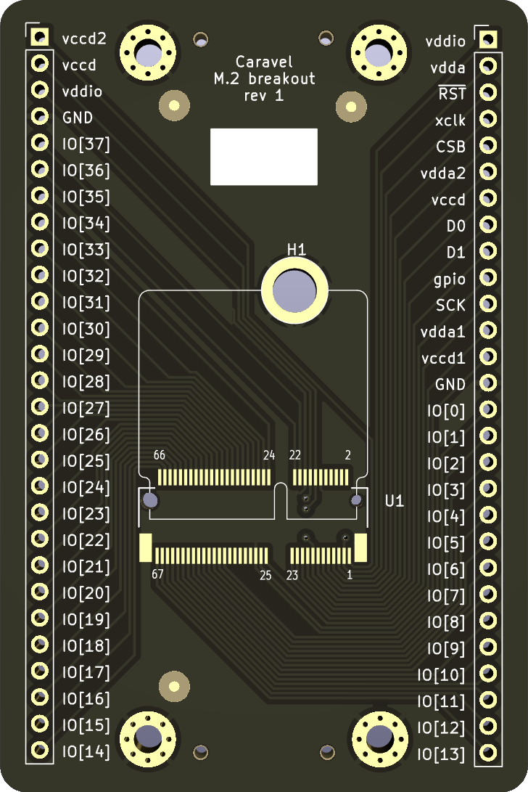
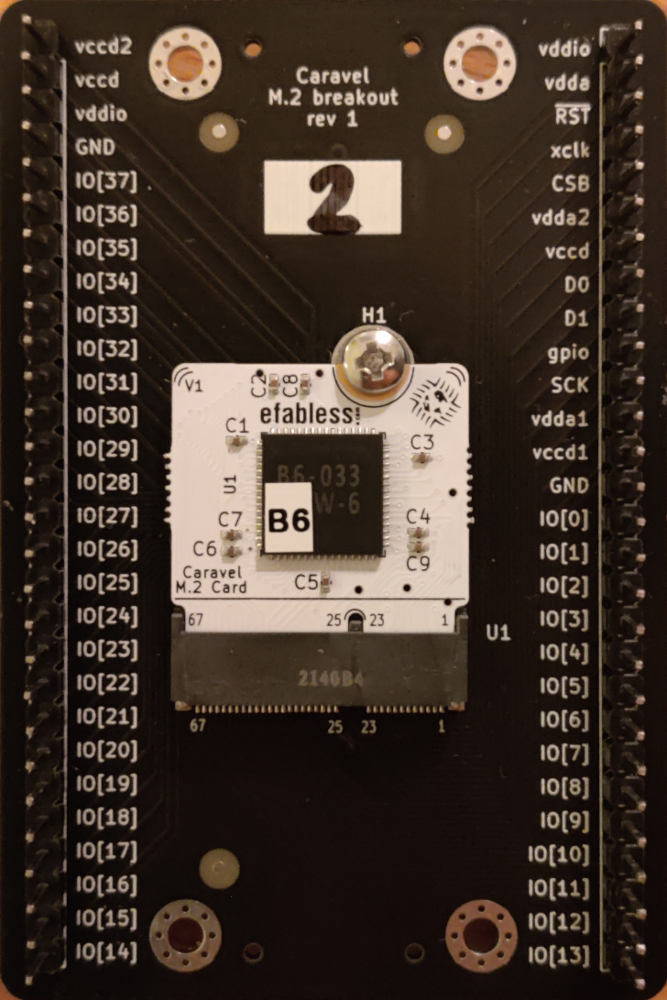

# Caravel M.2 breakout

Minimalist breakout board for
[M.2 E-key daughtercards](https://github.com/efabless/caravel_board/tree/main/hardware/breakout/caravel-M.2-card-QFN)
shipped with OpenMPW/chipIgnite ICs.

